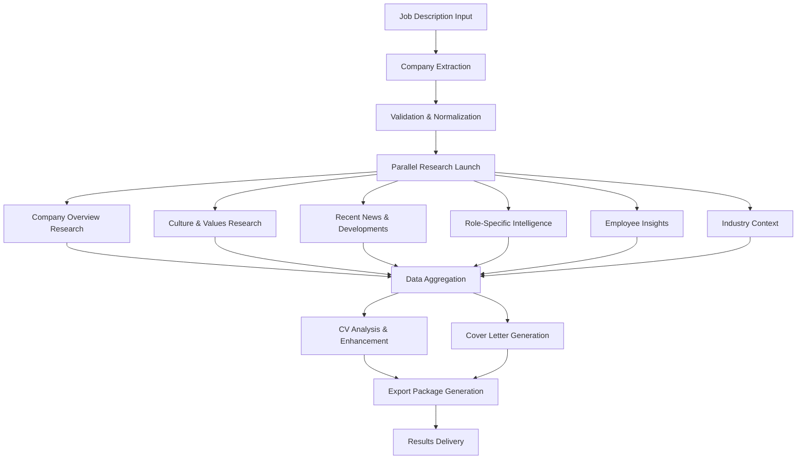

# N8n Workflow Design for CV Improver
## Comprehensive Company Research & CV Enhancement Pipeline

### Version: 1.0
### Last Updated: July 27, 2025
### Based on: Competitive research workflow pattern

---

## 🔄 Complete Workflow Overview



---

## 📋 Step-by-Step Workflow Design

### **Step 1: Job Description Processing**
**Node Type**: Webhook Trigger
**Purpose**: Receive job description text from Lovable frontend

```json
{
  "webhook_config": {
    "method": "POST",
    "authentication": "header_auth",
    "response_mode": "lastNode"
  },
  "input_data": {
    "job_description": "string",
    "cv_content": "string", 
    "user_id": "string",
    "session_id": "string"
  }
}
```

### **Step 2: Company Name Extraction**
**Node Type**: OpenAI
**Purpose**: Extract and normalize company name from job description

**Prompt Template**:
```
Extract the company name from this job description. Handle variations like:
- Parent companies vs subsidiaries
- Department mentions
- Multiple company references

Job Description: {{$json["job_description"]}}

Return only the primary company name in this format:
{
  "company_name": "exact company name",
  "confidence": 0.95,
  "variations": ["alt name 1", "alt name 2"],
  "industry_hint": "tech/finance/healthcare/etc"
}
```

### **Step 3: Company Validation & Enrichment**
**Node Type**: HTTP Request (Optional validation)
**Purpose**: Verify company exists and get basic info

```json
{
  "validation_checks": [
    "Company website lookup",
    "LinkedIn company page",
    "Basic company info verification"
  ],
  "enrichment_data": {
    "company_size": "startup/enterprise/etc",
    "headquarters": "location",
    "founded_year": "year"
  }
}
```

### **Step 4: Parallel Research Launch**
**Node Type**: Split in Batches
**Purpose**: Launch 6 parallel research streams

---

## 🔍 **Research Stream 1: Company Overview**
**Node Type**: Exa Search
**Purpose**: Core company information

**Search Queries**:
```json
{
  "queries": [
    "{{company_name}} company overview mission values",
    "{{company_name}} about us company culture",
    "{{company_name}} leadership team executives",
    "{{company_name}} business model revenue strategy"
  ],
  "filters": {
    "domain_include": ["company website", "crunchbase", "linkedin"],
    "published_after": "2023-01-01"
  }
}
```

**Output Processing**:
```json
{
  "company_overview": {
    "mission": "extracted mission statement",
    "values": ["value 1", "value 2"],
    "leadership": ["CEO name", "key executives"],
    "business_focus": "core business description"
  }
}
```

---

## 🎨 **Research Stream 2: Culture & Values Deep Dive**
**Node Type**: Exa Search
**Purpose**: Company culture and work environment

**Search Queries**:
```json
{
  "queries": [
    "{{company_name}} company culture work environment",
    "{{company_name}} employee benefits perks",
    "{{company_name}} diversity inclusion initiatives",
    "{{company_name}} remote work hybrid policy",
    "{{company_name}} career development growth"
  ]
}
```

**Output Processing**:
```json
{
  "culture_analysis": {
    "work_style": "remote/hybrid/office",
    "core_values": ["innovation", "collaboration"],
    "benefits_highlights": ["health insurance", "stock options"],
    "growth_opportunities": "career development info"
  }
}
```

---

## 📰 **Research Stream 3: Recent News & Developments**
**Node Type**: Exa Search
**Purpose**: Current company status and recent achievements

**Search Queries**:
```json
{
  "queries": [
    "{{company_name}} news funding acquisition 2024 2025",
    "{{company_name}} product launch new features recent",
    "{{company_name}} expansion hiring growth 2024 2025",
    "{{company_name}} partnerships collaborations recent"
  ],
  "time_filter": "last_6_months"
}
```

**Output Processing**:
```json
{
  "recent_developments": {
    "funding_news": "recent funding rounds",
    "product_updates": "new features/products",
    "growth_indicators": "hiring, expansion news",
    "market_position": "competitive developments"
  }
}
```

---

## 🎯 **Research Stream 4: Role-Specific Intelligence**
**Node Type**: Exa Search + OpenAI Analysis
**Purpose**: Department and role-specific insights

**Search Queries**:
```json
{
  "queries": [
    "{{company_name}} {{job_title}} team structure",
    "{{company_name}} {{department}} technologies tools stack",
    "{{company_name}} {{job_title}} skills requirements",
    "{{company_name}} engineering culture development practices"
  ]
}
```

**AI Analysis Prompt**:
```
Analyze this job description and company research to identify:
1. Key technologies and tools they use
2. Team structure and collaboration style
3. Specific skills they prioritize
4. Project types and methodologies

Job Description: {{job_description}}
Company Research: {{research_data}}

Format as actionable CV enhancement suggestions.
```

---

## 👥 **Research Stream 5: Employee Insights**
**Node Type**: Exa Search
**Purpose**: Employee perspectives and interview insights

**Search Queries**:
```json
{
  "queries": [
    "{{company_name}} employee reviews glassdoor indeed",
    "{{company_name}} interview process experience",
    "{{company_name}} work life balance employee satisfaction",
    "{{company_name}} career growth promotion opportunities"
  ]
}
```

**Output Processing**:
```json
{
  "employee_insights": {
    "interview_process": "typical interview stages",
    "work_satisfaction": "employee sentiment",
    "growth_opportunities": "promotion patterns",
    "pain_points": "common employee concerns"
  }
}
```

---

## 🏢 **Research Stream 6: Industry Context**
**Node Type**: FireCrawl + Exa Search
**Purpose**: Industry trends and competitive landscape

**Search Queries**:
```json
{
  "queries": [
    "{{industry}} trends 2024 2025 market analysis",
    "{{industry}} skills demand job market",
    "{{company_name}} competitors market position",
    "{{industry}} salary compensation benchmarks"
  ]
}
```

---

## 🔄 **Step 5: Data Aggregation & Analysis**
**Node Type**: OpenAI + Custom Function
**Purpose**: Synthesize all research into actionable insights

**Aggregation Prompt**:
```
Synthesize this comprehensive company research into CV improvement strategies:

Company Overview: {{company_overview}}
Culture & Values: {{culture_analysis}}
Recent News: {{recent_developments}}
Role Intelligence: {{role_insights}}
Employee Insights: {{employee_insights}}
Industry Context: {{industry_context}}

Generate:
1. CV enhancement suggestions (specific, actionable)
2. Key skills to emphasize
3. Experience reframing opportunities
4. Company-specific language to use
5. Cultural fit indicators to highlight

Original CV: {{cv_content}}
Job Description: {{job_description}}
```

---

## 📝 **Step 6: CV Enhancement Generation**
**Node Type**: OpenAI
**Purpose**: Generate specific CV improvements

**Enhancement Prompt**:
```
Based on this comprehensive company research, improve this CV for maximum impact:

Research Insights: {{aggregated_insights}}
Original CV: {{cv_content}}
Target Job: {{job_description}}

Generate specific improvements:
1. Rewritten experience descriptions
2. Enhanced skill sections
3. Optimized summary/objective
4. Industry-specific keywords
5. Achievement quantification suggestions

Focus on:
- ATS optimization
- Company culture alignment  
- Role-specific requirements
- Anti-AI detection (human-like, research-backed)
```

---

## 💌 **Step 7: Cover Letter Generation**
**Node Type**: OpenAI
**Purpose**: Create research-backed, personalized cover letter

**Cover Letter Prompt**:
```
Create a compelling cover letter using this deep company research:

Company Intelligence: {{all_research_data}}
CV Content: {{cv_content}}
Job Requirements: {{job_description}}

Include:
- Specific company knowledge (recent news, values, mission)
- Role understanding (technologies, team dynamics)
- Cultural fit demonstration
- Authentic personal connection to company mission
- Specific examples from CV aligned with their needs

Style: Professional but authentic, research-informed, human-like
Length: 3-4 paragraphs, concise but compelling
```

---

## 📤 **Step 8: Export Package Generation**
**Node Type**: Custom Function + HTTP Request
**Purpose**: Generate final documents in multiple formats

**Export Processing**:
```json
{
  "outputs": {
    "enhanced_cv": {
      "format": "markdown",
      "includes": ["original", "improved", "diff_view"]
    },
    "cover_letter": {
      "format": "markdown", 
      "variations": ["standard", "brief", "detailed"]
    },
    "research_summary": {
      "company_insights": "key findings",
      "improvement_rationale": "why changes were made"
    },
    "pdf_exports": {
      "cv": "professional_template.pdf",
      "cover_letter": "matching_template.pdf"
    }
  }
}
```

---

## 🔄 **Step 9: Results Delivery**
**Node Type**: HTTP Request (to Supabase) + Webhook Response
**Purpose**: Save results and notify frontend

**Data Storage**:
```json
{
  "supabase_insert": {
    "table": "cv_improvements",
    "data": {
      "user_id": "{{user_id}}",
      "session_id": "{{session_id}}",
      "company_research": "{{research_data}}",
      "cv_improvements": "{{enhanced_cv}}",
      "cover_letter": "{{cover_letter}}",
      "created_at": "timestamp"
    }
  }
}
```

**Frontend Response**:
```json
{
  "status": "completed",
  "session_id": "{{session_id}}",
  "results": {
    "cv_improvements": "{{enhanced_cv}}",
    "cover_letter": "{{cover_letter}}",
    "research_insights": "{{company_insights}}",
    "export_urls": {
      "cv_pdf": "download_url",
      "cover_letter_pdf": "download_url"
    }
  }
}
```

---

## ⚡ **Performance Optimizations**

### **Parallel Processing**:
- 6 research streams run simultaneously
- 30-60 second total processing time
- Fail-safe fallbacks for each stream

### **Caching Strategy**:
```json
{
  "company_cache": {
    "duration": "24_hours",
    "key": "company_name",
    "includes": ["overview", "culture", "recent_news"]
  },
  "industry_cache": {
    "duration": "7_days", 
    "key": "industry_sector",
    "includes": ["trends", "skills", "benchmarks"]
  }
}
```

### **Error Handling**:
- Graceful degradation if research streams fail
- Minimum viable output even with partial data
- User notification of any research limitations

---

## 🔧 **Implementation Checklist**

### **Week 1: Core Setup**
- [ ] N8n workflow canvas setup
- [ ] Webhook trigger configuration
- [ ] OpenAI node configuration
- [ ] Basic company extraction testing

### **Week 2: Research Streams**
- [ ] Exa Search API integration
- [ ] FireCrawl backup integration
- [ ] 6 parallel research workflows
- [ ] Data aggregation logic

### **Week 3: Enhancement Generation**
- [ ] CV improvement AI prompts
- [ ] Cover letter generation
- [ ] Export functionality
- [ ] Supabase integration

### **Week 4: Testing & Optimization**
- [ ] End-to-end testing
- [ ] Performance optimization
- [ ] Error handling
- [ ] Caching implementation

---

## 🎯 **Expected Outcomes**

### **CV Improvements**:
- Company-specific language and terminology
- Role-aligned experience descriptions
- Cultural fit demonstration
- ATS-optimized keyword integration

### **Cover Letter Quality**:
- Research-backed company knowledge
- Authentic personal connection
- Specific role understanding
- Anti-AI detection authenticity

### **Processing Metrics**:
- 90%+ company extraction accuracy
- 85%+ research relevance score
- <60 second total processing time
- 95%+ user satisfaction with insights

---

This N8n workflow design creates a **comprehensive intelligence pipeline** that goes far beyond simple CV templates, delivering **research-backed, authentic application materials** that demonstrate genuine company knowledge and cultural fit.